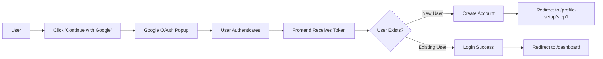

# Memora Frontend

<div align="center">
  <h3>🧠 Control Your AI Context</h3>
  <p>A modern React application for managing AI context and behavioral profiles across different platforms</p>
  
  
  
  
  
</div>

---

## 📋 Table of Contents

- [Overview](#overview)
- [Features](#features)
- [Tech Stack](#tech-stack)
- [Getting Started](#getting-started)
- [Project Structure](#project-structure)
- [Configuration](#configuration)
- [Available Scripts](#available-scripts)
- [Key Features](#key-features)
- [Authentication Flow](#authentication-flow)
- [Contributing](#contributing)
- [License](#license)

---

## 🎯 Overview

Memora Frontend is a sophisticated React-based web application designed to help users manage and control their AI context across multiple platforms. It provides intelligent behavioral profiling, session management, and seamless integration with popular AI tools like ChatGPT, Claude, and Google Gemini.

**Research Project**: SLIIT - AI Context Management & Behavioral Analysis

---

## ✨ Features

### 🔐 Authentication
- **Google OAuth 2.0** integration with `@react-oauth/google`
- Traditional email/password authentication
- Secure session management
- Protected route handling

### 🎨 User Experience
- **Modern, Responsive UI** - Built with Tailwind CSS and Framer Motion
- **Smooth Animations** - Advanced scroll-based animations and transitions
- **Mobile-First Design** - Fully responsive across all devices
- **Dark Theme** - Eye-friendly dark color scheme

### 📊 Dashboard Features
- **Profile Management** - Comprehensive user profile and behavior insights
- **Session Contexts** - Organize and manage different AI interaction sessions
- **Context Library** - Store and manage reusable context templates
- **User Profiles** - Multiple profile management for different use cases
- **Analytics & Insights** - Visual charts with Recharts for usage tracking
- **Tool Integration** - Connect and manage ChatGPT, Claude, and Gemini

### 🚀 Onboarding
- **Two-Step Profile Setup** - Guided user onboarding process
- **Smart Redirects** - Automatic routing based on user status
- **Profile Completion Tracking** - Progress indicators and validation

---

## 🛠️ Tech Stack

### Core Framework
- **React 19.2.0** - Latest React with modern hooks and features
- **React Router DOM 7.11.0** - Client-side routing and navigation
- **Vite 7.2.4** - Lightning-fast build tool and dev server

### UI & Styling
- **Tailwind CSS 3.4.19** - Utility-first CSS framework
- **Framer Motion 12.23.26** - Advanced animation library
- **Lucide React 0.562.0** - Beautiful, consistent icon set

### Data Visualization
- **Recharts 3.6.0** - Composable charting library

### Authentication
- **@react-oauth/google 0.13.4** - Google OAuth integration

### Development Tools
- **ESLint 9.39.1** - Code linting and quality
- **PostCSS 8.5.6** - CSS transformations
- **Autoprefixer 10.4.23** - CSS vendor prefixing

---

## 🚀 Getting Started

### Prerequisites

Ensure you have the following installed:
- **Node.js** 16.x or higher
- **npm** or **yarn** package manager
- **Backend API** server running (default: `http://localhost:8000`)
- **Google OAuth Client ID** ([Setup Guide](https://console.cloud.google.com/apis/credentials))

### Installation

1. **Clone the repository**
   ```bash
   git clone <repository-url>
   cd memora-frontend
   ```

2. **Install dependencies**
   ```bash
   npm install
   ```

3. **Configure environment variables**
   
   Create a `.env` file in the root directory:
   ```env
   VITE_API_URL=http://localhost:8000
   VITE_GOOGLE_CLIENT_ID=your-google-client-id.apps.googleusercontent.com
   ```

4. **Start development server**
   ```bash
   npm run dev
   ```

5. **Open your browser**
   
   Navigate to `http://localhost:5173`

---

## 📁 Project Structure

```
memora-frontend/
├── public/                 # Static assets
├── src/
│   ├── components/         # React components
│   │   ├── LandingPage.jsx          # Marketing landing page
│   │   ├── Signin.jsx               # Login page (OAuth + traditional)
│   │   ├── Signup.jsx               # Registration page
│   │   ├── ProfileSetupStep1.jsx    # Onboarding - Step 1
│   │   ├── ProfileSetupStep2.jsx    # Onboarding - Step 2
│   │   ├── Dashboard.jsx            # Main dashboard
│   │   ├── ProfileInsights.jsx      # Profile analytics
│   │   ├── SessionManagement.jsx    # Session context management
│   │   ├── ContextLibrary.jsx       # Context template library
│   │   └── UserProfiles.jsx         # Profile management
│   ├── config/            # Configuration files
│   │   ├── api.js         # API endpoints and OAuth functions
│   │   └── oauth.js       # OAuth provider configuration
│   ├── assets/            # Images, fonts, etc.
│   ├── App.jsx            # Main app with routing
│   ├── main.jsx           # Application entry point
│   └── index.css          # Global styles
├── .env                   # Environment variables (create this)
├── eslint.config.js       # ESLint configuration
├── postcss.config.js      # PostCSS configuration
├── tailwind.config.js     # Tailwind CSS configuration
├── vite.config.js         # Vite configuration
├── package.json           # Project dependencies
└── README.md              # This file
```

---

## ⚙️ Configuration

### Environment Variables

| Variable | Description | Required | Default |
|----------|-------------|----------|---------|
| `VITE_API_URL` | Backend API base URL | Yes | `http://localhost:8000` |
| `VITE_GOOGLE_CLIENT_ID` | Google OAuth Client ID | Yes | - |

### API Configuration

The API configuration is managed in `src/config/api.js`:

```javascript
export const API_BASE_URL = import.meta.env.VITE_API_URL || 'http://localhost:8000';
export const API_VERSION = '/api/v1';
```

**Available API Endpoints:**
- User Profile: `GET /api/v1/get-user-profile/{userId}`
- Core Behaviors: `GET /api/v1/list-core-behaviors/{userId}`
- Behavior Analysis: `GET /api/v1/analyze-behaviors-from-storage`
- LLM Context: `GET /api/v1/profile/{userId}/llm-context`
- OAuth Login: `POST /api/users/oauth/login`
- OAuth Signup: `POST /api/users/oauth/signup`

---

## 📜 Available Scripts

| Command | Description |
|---------|-------------|
| `npm run dev` | Start development server on `http://localhost:5173` |
| `npm run build` | Build production-ready bundle to `dist/` |
| `npm run preview` | Preview production build locally |
| `npm run lint` | Run ESLint to check code quality |

---

## 🎯 Key Features

### 1. Landing Page
- Modern, animated hero section with Framer Motion
- Feature highlights with scroll-triggered animations
- Responsive design with mobile optimization
- Direct navigation to sign-in/sign-up

### 2. Authentication System
- **OAuth Flow**: One-click Google sign-in
- **Traditional Auth**: Email/password login and registration
- **Session Persistence**: LocalStorage and SessionStorage
- **Protected Routes**: Automatic redirects for unauthorized users

### 3. Dashboard
- **Real-time Statistics**: Visual charts showing usage patterns
- **Tool Connections**: Manage integrations with AI platforms
- **Quick Actions**: Fast access to common tasks
- **Profile Management**: User settings and preferences
- **Responsive Layout**: Collapsible sidebar, mobile-friendly

### 4. Session Management
- Create and organize different context sessions (Research, Coding, Writing)
- Toggle active/inactive sessions
- Search and filter capabilities
- Delete unwanted sessions
- Visual status indicators

### 5. Profile Insights
- Behavioral analysis visualization
- Core behavior patterns
- Activity tracking
- Historical data charts

### 6. Context Library
- Store reusable context templates
- Quick insertion into AI conversations
- Categorization and search
- Version control for contexts

---

## 🔐 Authentication Flow

### OAuth (Google) Flow



### Traditional Auth Flow

1. User enters email and password
2. Frontend sends credentials to backend `/api/users/login`
3. Backend validates and returns JWT token
4. Frontend stores token in localStorage/sessionStorage
5. User redirected to dashboard

---

## 🤝 Contributing

Contributions are welcome! Please follow these steps:

1. **Fork the repository**
2. **Create a feature branch** (`git checkout -b feature/AmazingFeature`)
3. **Commit your changes** (`git commit -m 'Add some AmazingFeature'`)
4. **Push to the branch** (`git push origin feature/AmazingFeature`)
5. **Open a Pull Request**

### Code Style Guidelines
- Follow ESLint configuration
- Use functional components with hooks
- Maintain Tailwind CSS utility classes
- Write descriptive commit messages

---

## 📄 License

## 📧 Contact & Support

<div align="center">
  <p>Built with ❤️ using React, Vite, and Tailwind CSS</p>
  <p>© 2026 Memora - All Rights Reserved</p>
</div>
- **Tailwind CSS** - Styling
- **@react-oauth/google** - Google OAuth
- **Lucide React** - Icons
- **Framer Motion** - Animations
- **Recharts** - Data visualization

## Security

- OAuth Client Secret is never exposed in frontend
- JWT tokens used for API authentication
- User data stored in localStorage/sessionStorage
- HTTPS required for production OAuth

## License

© 2025 Memora Inc.
